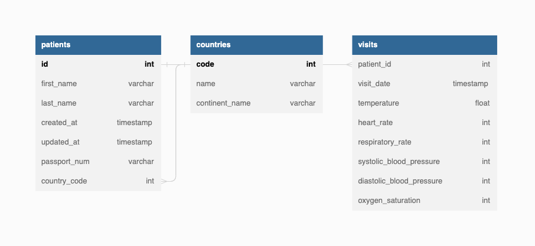

# Electronic Medical Records Information System

The purpose of this project is to create a FastAPI project. I did this by first following [Tiangolo's FastAPI workshop](https://github.com/tiangolo/blog-posts/tree/master/pyconby-web-api-from-scratch-with-fastapi). Moving forward, I want to  dockerize this application, and also make use of a database instead of having the database be a text file.
## File Structure

## Database Schema
Database was defined with DBML, and Dbdocs was used to generate a [web-based documentation for my database](https://dbdocs.io/fhasan7899/EMR_Information_System).

## APIs
